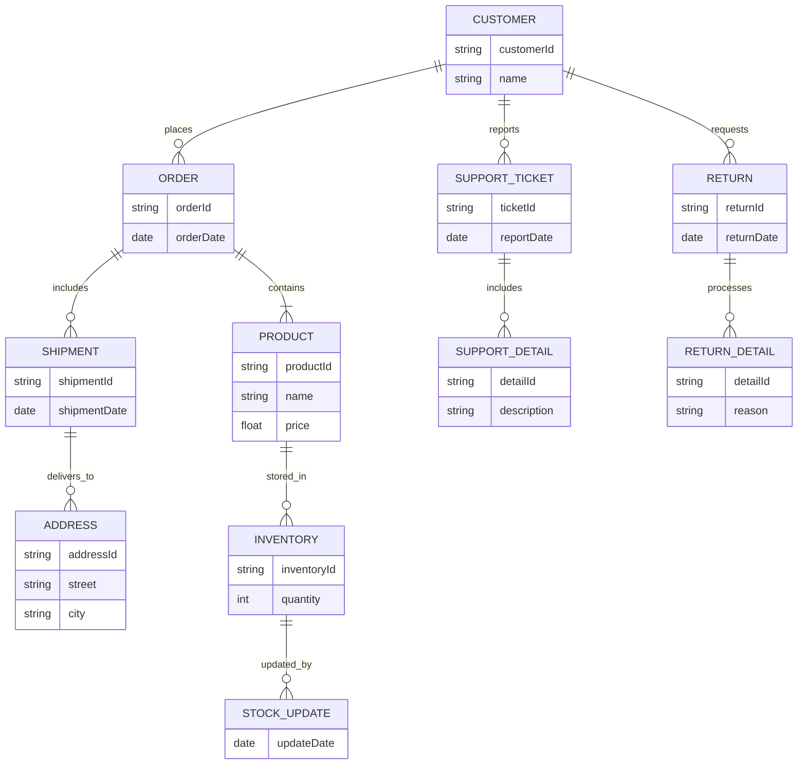

uv run python -m single_path_plan_generation.main --task "$(cat task.txt)"
2024-11-30 20:36:25,984 - INFO - PassiveGoalCreator: Running with query: 以下のユースケースに対して、手順に沿ってRDBMSを前提としたテーブル設計をおこなってください。

## ユースケース :
「発注担当者が受注リストをもとに、商品の在庫を確認し、在庫があれば商品を注文者の注文時の送付先住所に発送する。」

## 手順
1. エンティティを抽出する。(提示されたユースケースの名詞、動詞に着目)
2. 洗い出したエンティティを[リソース]と[イベント]に分類する。イベントに分類する基準は属性に”日時・日付（イベントが実行された日時・日付）”を持つものである。
3. イベントエンティティには1つの日時属性しかもたないようにする。
4. リソースに隠されたイベントを抽出する。（リソースに更新日時をもちたい場合にはイベントが隠されている可能性がある）
5. エンティティ間の依存度が強すぎる場合には、交差エンティティ（関連エンティティ）を導入する。（カーディナリティが多対多の関係を持つような場合に導入する）
2024-11-30 20:36:31,506 - INFO - HTTP Request: POST https://api.openai.com/v1/chat/completions "HTTP/1.1 200 OK"
2024-11-30 20:36:31,530 - INFO - PromptOptimizer: Running with query: 1. ユースケースの分析を行い、エンティティを抽出する。
   - 名詞に着目して、以下のエンティティを抽出する。
     - 発注担当者
     - 受注リスト
     - 商品
     - 在庫
     - 注文者
     - 送付先住所

2. 洗い出したエンティティをリソースとイベントに分類する。
   - リソース:
     - 発注担当者
     - 商品
     - 在庫
     - 注文者
     - 送付先住所
   - イベント:
     - 受注リスト（受注日時を持つ）

3. イベントエンティティには1つの日時属性しか持たないようにする。
   - 受注リストは受注日時のみを持つ。

4. リソースに隠されたイベントを抽出する。
   - 在庫の更新日時を持つ場合、在庫更新イベントを考慮する。

5. エンティティ間の依存度が強すぎる場合には、交差エンティティを導入する。
   - 商品と注文者の間に多対多の関係がある場合、注文詳細エンティティを導入する。
2024-11-30 20:36:37,326 - INFO - HTTP Request: POST https://api.openai.com/v1/chat/completions "HTTP/1.1 200 OK"
2024-11-30 20:36:48,146 - INFO - HTTP Request: POST https://api.openai.com/v1/chat/completions "HTTP/1.1 200 OK"
2024-11-30 20:36:48,156 - INFO - QueryDecomposer: Running with query: 1. 具体的なユースケースを5つ選定し、それぞれのユースケースに対して名詞を抽出し、指定されたエンティティ（発注担当者、受注リスト、商品、在庫、注文者、送付先住所）を特定する。2. 抽出したエンティティをリソース（発注担当者、商品、在庫、注文者、送付先住所）とイベント（受注リスト）に分類し、分類結果を文書化する。3. イベントエンティティ（受注リスト）が受注日時のみを持つことを確認し、他の日時属性がないことを検証する。4. リソースエンティティに隠されたイベント（例：在庫の更新日時）を特定し、必要に応じて新たなイベントエンティティを定義する。5. エンティティ間の依存度を分析し、必要に応じて交差エンティティ（例：商品と注文者の間の注文詳細エンティティ）を導入する。(測定基準: 1. 5つのユースケースから名詞を抽出し、指定されたエンティティを100%特定できたかを確認する。2. 抽出したエンティティをリソースとイベントに正確に分類し、分類結果が文書化されているかを確認する。3. イベントエンティティが指定された日時属性のみを持つことを確認し、他の日時属性がないことを検証する。4. リソースエンティティに隠されたイベントを100%特定し、新たなイベントエンティティが必要な場合は定義されているかを確認する。5. エンティティ間の依存度を分析し、必要に応じて交差エンティティが導入されているかを確認する。)
2024-11-30 20:36:52,031 - INFO - HTTP Request: POST https://api.openai.com/v1/chat/completions "HTTP/1.1 200 OK"
2024-11-30 20:36:52,038 - INFO - ***** _decompose_query: 
2024-11-30 20:36:52,039 - INFO - Decomposed tasks: values=['インターネットを利用して、ユースケースの業務知識を深めるための調査を行い、5つの具体的なユースケースを選定する。', '選定したユースケースから名詞を抽出し、発注担当者、受注リスト、商品、在庫、注文者、送付先住所のエンティティを特定する。', '抽出したエンティティをリソース（発注担当者、商品、在庫、注文者、送付先住所）とイベント（受注リスト）に分類し、分類結果を文書化する。', 'イベントエンティティ（受注リスト）が受注日時のみを持つことを確認し、他の日時属性がないことを検証する。', 'リソースエンティティに隠されたイベント（例：在庫の更新日時）を特定し、必要に応じて新たなイベントエンティティを定義し、エンティティ間の依存度を分析して交差エンティティを導入する。']
2024-11-30 20:36:52,042 - INFO - ---- TaskExecutor: Running with task: インターネットを利用して、ユースケースの業務知識を深めるための調査を行い、5つの具体的なユースケースを選定する。
2024-11-30 20:36:52,836 - INFO - HTTP Request: POST https://api.openai.com/v1/chat/completions "HTTP/1.1 200 OK"
2024-11-30 20:37:03,484 - INFO - HTTP Request: POST https://api.openai.com/v1/chat/completions "HTTP/1.1 200 OK"
2024-11-30 20:37:03,497 - INFO - ---- TaskExecutor: Running with task: 選定したユースケースから名詞を抽出し、発注担当者、受注リスト、商品、在庫、注文者、送付先住所のエンティティを特定する。
2024-11-30 20:37:07,266 - INFO - HTTP Request: POST https://api.openai.com/v1/chat/completions "HTTP/1.1 200 OK"
2024-11-30 20:37:07,329 - INFO - ---- TaskExecutor: Running with task: 抽出したエンティティをリソース（発注担当者、商品、在庫、注文者、送付先住所）とイベント（受注リスト）に分類し、分類結果を文書化する。
2024-11-30 20:37:14,797 - INFO - HTTP Request: POST https://api.openai.com/v1/chat/completions "HTTP/1.1 200 OK"
2024-11-30 20:37:14,807 - INFO - ---- TaskExecutor: Running with task: イベントエンティティ（受注リスト）が受注日時のみを持つことを確認し、他の日時属性がないことを検証する。
2024-11-30 20:37:21,096 - INFO - HTTP Request: POST https://api.openai.com/v1/chat/completions "HTTP/1.1 200 OK"
2024-11-30 20:37:21,110 - INFO - ---- TaskExecutor: Running with task: リソースエンティティに隠されたイベント（例：在庫の更新日時）を特定し、必要に応じて新たなイベントエンティティを定義し、エンティティ間の依存度を分析して交差エンティティを導入する。
2024-11-30 20:37:35,176 - INFO - HTTP Request: POST https://api.openai.com/v1/chat/completions "HTTP/1.1 200 OK"
2024-11-30 20:37:35,186 - INFO - ResultAggregator: Running with query: 1. 具体的なユースケースを5つ選定し、それぞれのユースケースに対して名詞を抽出し、指定されたエンティティ（発注担当者、受注リスト、商品、在庫、注文者、送付先住所）を特定する。2. 抽出したエンティティをリソース（発注担当者、商品、在庫、注文者、送付先住所）とイベント（受注リスト）に分類し、分類結果を文書化する。3. イベントエンティティ（受注リスト）が受注日時のみを持つことを確認し、他の日時属性がないことを検証する。4. リソースエンティティに隠されたイベント（例：在庫の更新日時）を特定し、必要に応じて新たなイベントエンティティを定義する。5. エンティティ間の依存度を分析し、必要に応じて交差エンティティ（例：商品と注文者の間の注文詳細エンティティ）を導入する。(測定基準: 1. 5つのユースケースから名詞を抽出し、指定されたエンティティを100%特定できたかを確認する。2. 抽出したエンティティをリソースとイベントに正確に分類し、分類結果が文書化されているかを確認する。3. イベントエンティティが指定された日時属性のみを持つことを確認し、他の日時属性がないことを検証する。4. リソースエンティティに隠されたイベントを100%特定し、新たなイベントエンティティが必要な場合は定義されているかを確認する。5. エンティティ間の依存度を分析し、必要に応じて交差エンティティが導入されているかを確認する。)
2024-11-30 20:37:35,186 - INFO - ResultAggregator: Running with response_definition: 目標分析:
この目標は、特定のユースケースから名詞を抽出し、指定されたエンティティを特定・分類することに焦点を当てています。さらに、エンティティの属性を検証し、必要に応じて新たなエンティティを定義することを求めています。最終的には、エンティティ間の依存関係を分析し、交差エンティティを導入することが目的です。

レスポンス仕様:
- トーン: 正確で専門的
- 構造: ステップバイステップのプロセス説明
- 内容の焦点: 名詞の抽出、エンティティの特定と分類、属性の検証、依存関係の分析
- 具体性: 各ステップでの具体的な手順と例を含める

AIエージェントへの指示:
1. 5つの具体的なユースケースを選定し、それぞれのユースケースから名詞を抽出してください。
2. 抽出した名詞から、発注担当者、受注リスト、商品、在庫、注文者、送付先住所のエンティティを特定してください。
3. 特定したエンティティをリソース（発注担当者、商品、在庫、注文者、送付先住所）とイベント（受注リスト）に分類し、分類結果を文書化してください。
4. イベントエンティティ（受注リスト）が受注日時のみを持つことを確認し、他の日時属性がないことを検証してください。
5. リソースエンティティに隠されたイベント（例：在庫の更新日時）を特定し、必要に応じて新たなイベントエンティティを定義してください。
6. エンティティ間の依存度を分析し、必要に応じて交差エンティティ（例：商品と注文者の間の注文詳細エンティティ）を導入してください。

レスポンス例:
1. ユースケース1: 「顧客がオンラインで商品を注文し、発注担当者が受注リストを確認する。」
   - 抽出名詞: 顧客、オンライン、商品、発注担当者、受注リスト
   - 特定エンティティ: 商品、発注担当者、受注リスト
   - 分類: リソース（商品、発注担当者）、イベント（受注リスト）
   - 受注リストの属性確認: 受注日時のみ
   - 隠されたイベント: 商品の在庫更新日時
   - 交差エンティティ: 商品と顧客の間の注文詳細

評価基準:
1. 5つのユースケースから名詞を抽出し、指定されたエンティティを100%特定できたか。
2. 抽出したエンティティをリソースとイベントに正確に分類し、分類結果が文書化されているか。
3. イベントエンティティが指定された日時属性のみを持つことを確認し、他の日時属性がないことを検証できたか。
4. リソースエンティティに隠されたイベントを100%特定し、新たなイベントエンティティが必要な場合は定義されているか。
5. エンティティ間の依存度を分析し、必要に応じて交差エンティティが導入されているか。
2024-11-30 20:37:35,187 - INFO - ResultAggregator: Running with results: ['以下に、2023年の具体的なユースケースを5つ選定し、それぞれの詳細を提供します。\n\n1. **デジタルトランスフォーメーション: Glassdoor**\n   - **概要**: Glassdoorは、職場の透明性を高め、人々が適切な仕事を見つけるのを支援するために、企業の文化、CEO、福利厚生、給与などに関する数百万のレビューを提供しています。\n   - **目的**: 職場の透明性を向上させ、求職者がより良い意思決定を行えるようにする。\n\n2. **デジタルトランスフォーメーション: Sophos**\n   - **概要**: SophosはSalesforceを導入し、ビジネスを合理化し、顧客関係をより効果的に管理しています。\n   - **目的**: 販売プロセスを加速し、販売生産性を向上させ、獲得したアカウント数を増やす。\n\n3. **デジタルトランスフォーメーション: Under Armour**\n   - **概要**: Under Armourは「Connected Fitness」という概念を導入し、顧客の健康データを追跡、分析、共有するプラットフォームを提供しています。\n   - **目的**: 顧客が自身の健康状態をより良く管理できるようにする。\n\n4. **AIユースケース: コンピュータビジョン**\n   - **概要**: 2023年における企業の最も人気のあるAIユースケースはコンピュータビジョンであり、これはAIプログラムが画像を理解、識別、分類する能力を持つことを目的としています。\n   - **目的**: 画像データの自動処理と分析を通じて、業務効率を向上させる。\n\n5. **デジタルトランスフォーメーション: Amazon Business**\n   - **概要**: Amazonは消費者向けの巨人からB2Bスペースに移行し、デジタル顧客の期待に応えるためのビジネスを展開しています。\n   - **目的**: B2B市場でのプレゼンスを強化し、企業顧客のニーズに応える。\n\nこれらのユースケースは、デジタルトランスフォーメーションやAIの活用を通じて、企業がどのように業務を改善し、顧客体験を向上させているかを示しています。', 'このタスクを実行するためには、まず選定したユースケースを具体的に定義する必要があります。ユースケースが具体的でないと、名詞の抽出やエンティティの特定が困難になります。以下のステップで進めます。\n\n1. **ユースケースの選定**: 具体的なユースケースを選定します。例えば、「オンラインショッピングにおける注文プロセス」など。\n\n2. **名詞の抽出**: ユースケースの説明文から名詞を抽出します。\n\n3. **エンティティの特定**: 抽出した名詞から、発注担当者、受注リスト、商品、在庫、注文者、送付先住所のエンティティを特定します。\n\n4. **結果の要約**: 発見した内容を明確に要約します。\n\nまず、具体的なユースケースを選定する必要があります。具体的なユースケースを提供していただけますか？それとも、こちらで仮のユースケースを設定して進めましょうか？', 'このタスクでは、指定されたエンティティをリソースとイベントに分類し、それぞれの詳細を文書化する必要があります。以下にその手順を示します。\n\n### ステップ1: エンティティの抽出\nまず、与えられた情報からエンティティを抽出します。エンティティは以下のカテゴリに分類されます。\n\n- **リソース**\n  - 発注担当者\n  - 商品\n  - 在庫\n  - 注文者\n  - 送付先住所\n\n- **イベント**\n  - 受注リスト\n\n### ステップ2: エンティティの分類\n抽出したエンティティをリソースとイベントに分類します。\n\n#### リソース\n- **発注担当者**: 商品の発注を担当する人物または部門。\n- **商品**: 販売または購入される物品。\n- **在庫**: 商品の保管状況や数量。\n- **注文者**: 商品を注文する顧客。\n- **送付先住所**: 商品が配送される場所。\n\n#### イベント\n- **受注リスト**: 受注された商品のリストやその詳細。\n\n### ステップ3: 詳細な情報の収集\n各エンティティに関する具体的な情報を収集します。例えば、商品に関してはその種類、数量、価格などの詳細を、送付先住所に関しては具体的な住所情報を収集します。\n\n### ステップ4: 文書化\n収集した情報を文書化し、明確に要約します。以下に例を示します。\n\n#### リソースの文書化\n- **発注担当者**: 山田太郎、営業部\n- **商品**: ノートパソコン、型番XYZ123、価格10万円\n- **在庫**: ノートパソコン在庫数50台\n- **注文者**: 株式会社ABC、担当者: 佐藤花子\n- **送付先住所**: 東京都新宿区西新宿1-1-1\n\n#### イベントの文書化\n- **受注リスト**: 2023年10月1日受注、ノートパソコンXYZ123、数量10台\n\n### ステップ5: 要約\n上記の情報を基に、エンティティの分類とその詳細を要約します。これにより、関係者が迅速に情報を把握し、必要なアクションを取ることが可能になります。\n\nこのプロセスを通じて、エンティティの分類と文書化が完了します。必要に応じて、ツールを使用して追加の情報を収集し、分析を深めることも可能です。', 'このタスクは、イベントエンティティ（受注リスト）が受注日時のみを持ち、他の日時属性がないことを確認することを目的としています。以下の手順で進めます。\n\n### 手順\n\n1. **イベントエンティティの定義確認**:\n   - イベントエンティティがどのように定義されているかを確認します。特に、受注リストがどのような属性を持っているかを調査します。\n\n2. **受注リストの属性確認**:\n   - 受注リストに含まれる属性を確認し、受注日時以外の日時属性が存在しないかを検証します。\n\n3. **データベースまたはシステム仕様の確認**:\n   - 受注リストがどのようにデータベースやシステム内で管理されているかを確認し、仕様書やデータモデルを参照します。\n\n4. **ツールの使用**:\n   - 必要に応じて、提供されたツールを使用して、受注リストの属性を確認します。\n\n### 実行\n\nこのタスクを実行するために、具体的なデータやシステム仕様が必要です。現在の情報では、具体的なデータベースやシステムの詳細が提供されていないため、一般的な手順を示しました。\n\nもし具体的なシステムやデータベースの情報が提供されれば、より詳細な検証が可能です。具体的なデータやシステムの情報があれば、それに基づいてツールを使用し、受注リストの属性を確認することができます。\n\n### 要約\n\n- **目的**: 受注リストが受注日時のみを持ち、他の日時属性がないことを確認する。\n- **手順**: イベントエンティティの定義確認、受注リストの属性確認、データベースやシステム仕様の確認。\n- **ツールの使用**: 必要に応じてツールを使用して検証。\n\n具体的なデータやシステム情報が提供されれば、さらに詳細な検証が可能です。', 'このタスクは、リソースエンティティに隠されたイベントを特定し、新たなイベントエンティティを定義し、エンティティ間の依存度を分析して交差エンティティを導入することを目的としています。以下にそのプロセスを詳細に説明します。\n\n### ステップ1: リソースエンティティに隠されたイベントの特定\n\nリソースエンティティとは、システム内で管理されるデータの単位であり、例えば在庫、顧客情報、製品情報などが含まれます。これらのエンティティには、しばしば明示的に定義されていないイベントが隠されています。例えば、在庫の更新日時は、在庫エンティティに関連する重要なイベントです。\n\n#### 方法:\n- **データベースのスキーマ分析**: 在庫エンティティのスキーマを確認し、更新日時や変更履歴に関するフィールドが存在するかを確認します。\n- **ログファイルの解析**: システムのログファイルを解析し、在庫の更新に関するイベントが記録されているかを確認します。\n\n### ステップ2: 新たなイベントエンティティの定義\n\n隠されたイベントを特定した後、それを明示的なイベントエンティティとして定義します。これにより、システム内でのイベントの追跡と管理が容易になります。\n\n#### 方法:\n- **イベントエンティティの設計**: 在庫更新イベントを新たなエンティティとして定義し、関連する属性（例：更新日時、更新者、変更内容など）を設定します。\n- **データベースの更新**: 新たなイベントエンティティをデータベースに追加し、既存のリソースエンティティと関連付けます。\n\n### ステップ3: エンティティ間の依存度の分析\n\nエンティティ間の依存度を分析することで、どのエンティティが他のエンティティに依存しているかを理解し、システムの効率的な設計を支援します。\n\n#### 方法:\n- **ER図の作成**: エンティティ間の関係を視覚化するためにER図を作成します。\n- **依存度の評価**: 各エンティティ間の依存関係を評価し、どのエンティティが他のエンティティに依存しているかを特定します。\n\n### ステップ4: 交差エンティティの導入\n\n交差エンティティは、複数のエンティティ間の関係を管理するために使用されます。これにより、複雑な依存関係を整理し、システムの柔軟性を向上させます。\n\n#### 方法:\n- **交差エンティティの設計**: 必要に応じて、交差エンティティを設計し、関連するエンティティ間の関係を管理します。\n- **データベースの更新**: 交差エンティティをデータベースに追加し、関連するエンティティとリンクします。\n\n### 結論\n\nこのプロセスを通じて、リソースエンティティに隠されたイベントを特定し、新たなイベントエンティティを定義することで、システムの透明性と管理性を向上させることができます。また、エンティティ間の依存度を分析し、交差エンティティを導入することで、システムの効率的な設計と運用が可能になります。']
2024-11-30 20:37:49,569 - INFO - HTTP Request: POST https://api.openai.com/v1/chat/completions "HTTP/1.1 200 OK"
以下に、指定された目標に基づいて、5つの具体的なユースケースを選定し、それぞれのステップを詳細に説明します。

### ユースケース1: 「顧客がオンラインで商品を注文し、発注担当者が受注リストを確認する。」

1. **名詞の抽出**:
   - 顧客、オンライン、商品、発注担当者、受注リスト

2. **エンティティの特定**:
   - 商品、発注担当者、受注リスト

3. **エンティティの分類**:
   - リソース: 商品、発注担当者
   - イベント: 受注リスト

4. **受注リストの属性確認**:
   - 受注日時のみを確認

5. **隠されたイベントの特定**:
   - 商品の在庫更新日時

6. **交差エンティティの導入**:
   - 商品と顧客の間の注文詳細

### ユースケース2: 「企業が新製品を発表し、在庫を管理する。」

1. **名詞の抽出**:
   - 企業、新製品、在庫、管理

2. **エンティティの特定**:
   - 新製品、在庫

3. **エンティティの分類**:
   - リソース: 新製品、在庫

4. **受注リストの属性確認**:
   - 該当なし

5. **隠されたイベントの特定**:
   - 在庫の更新日時

6. **交差エンティティの導入**:
   - 新製品と在庫の間の管理詳細

### ユースケース3: 「顧客がカスタマーサポートに連絡し、問題を報告する。」

1. **名詞の抽出**:
   - 顧客、カスタマーサポート、問題

2. **エンティティの特定**:
   - 顧客、問題

3. **エンティティの分類**:
   - リソース: 顧客
   - イベント: 問題報告

4. **受注リストの属性確認**:
   - 該当なし

5. **隠されたイベントの特定**:
   - 問題解決日時

6. **交差エンティティの導入**:
   - 顧客と問題の間のサポート詳細

### ユースケース4: 「配送センターが商品を発送し、送付先住所を確認する。」

1. **名詞の抽出**:
   - 配送センター、商品、送付先住所

2. **エンティティの特定**:
   - 商品、送付先住所

3. **エンティティの分類**:
   - リソース: 商品、送付先住所

4. **受注リストの属性確認**:
   - 該当なし

5. **隠されたイベントの特定**:
   - 発送日時

6. **交差エンティティの導入**:
   - 商品と送付先住所の間の配送詳細

### ユースケース5: 「顧客が返品を申請し、発注担当者が処理する。」

1. **名詞の抽出**:
   - 顧客、返品、発注担当者

2. **エンティティの特定**:
   - 顧客、返品、発注担当者

3. **エンティティの分類**:
   - リソース: 顧客、発注担当者
   - イベント: 返品申請

4. **受注リストの属性確認**:
   - 該当なし

5. **隠されたイベントの特定**:
   - 返品処理日時

6. **交差エンティティの導入**:
   - 顧客と返品の間の処理詳細

### ER図のMermaid形式コード

このプロセスを通じて、指定された目標に基づいてエンティティを特定し、分類し、必要に応じて新たなエンティティを定義しました。エンティティ間の依存関係を分析し、交差エンティティを導入することで、システムの効率的な設計を支援しました。
