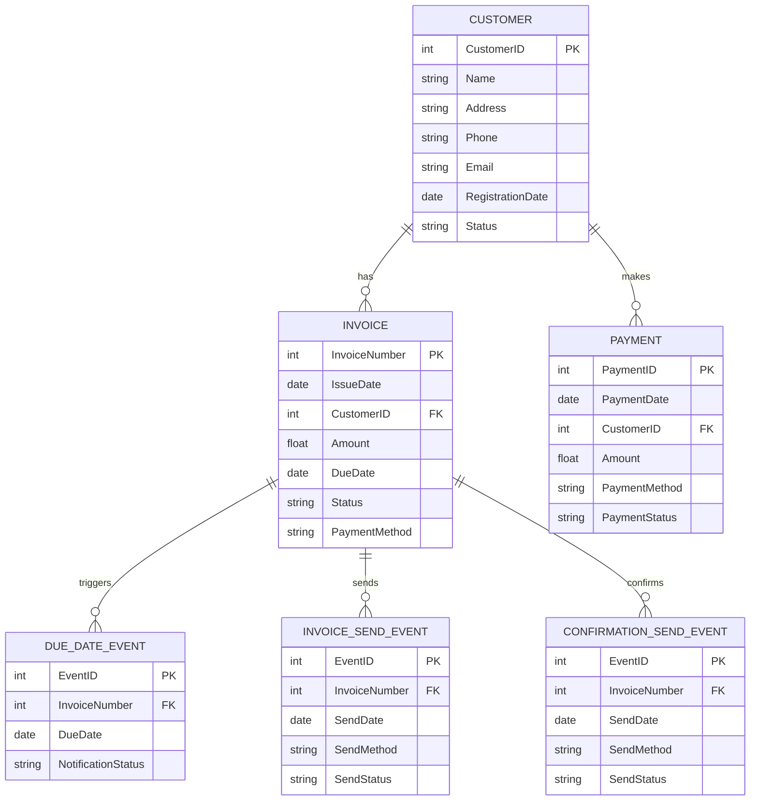

uv run python -m single_path_plan_generation.main --task "$(cat task2.txt)"
2024-12-01 08:26:14,116 - INFO - PassiveGoalCreator: Running with query: 以下のユースケースに対して、RDBMSを前提としたテーブル設計をおこなってください。

## ユースケース :
「請求期日が到来した場合、顧客に請求書を送付する。期日までに入金がない場合には、確認状を送付する。」
2024-12-01 08:26:21,878 - INFO - HTTP Request: POST https://api.openai.com/v1/chat/completions "HTTP/1.1 200 OK"
2024-12-01 08:26:21,900 - INFO - PromptOptimizer: Running with query: このユースケースに基づいて、RDBMSを前提としたテーブル設計を行います。以下の手順で進めます。

1. **エンティティの抽出**
   - 名詞と動詞に着目してエンティティを抽出します。
   - 名詞: 請求書、顧客、期日、入金、確認状
   - 動詞: 送付する、到来する、送付する

2. **エンティティの分類**
   - リソース: 請求書、顧客、入金、確認状
   - イベント: 請求期日の到来、請求書の送付、確認状の送付

3. **イベントエンティティの日時属性**
   - 請求期日の到来: 期日
   - 請求書の送付: 送付日
   - 確認状の送付: 送付日

4. **リソースに隠されたイベントの抽出**
   - 入金に関しては、入金日というイベントが隠されていると考えられます。

5. **交差エンティティの導入**
   - 請求書と顧客の間に多対多の関係がある場合、交差エンティティを導入します。

## テーブル設計

- **顧客テーブル**
  - 顧客ID (主キー)
  - 顧客名
  - 連絡先情報

- **請求書テーブル**
  - 請求書ID (主キー)
  - 顧客ID (外部キー)
  - 金額
  - 発行日
  - 期日

- **入金テーブル**
  - 入金ID (主キー)
  - 請求書ID (外部キー)
  - 入金日
  - 金額

- **請求期日イベントテーブル**
  - イベントID (主キー)
  - 請求書ID (外部キー)
  - 期日

- **請求書送付イベントテーブル**
  - イベントID (主キー)
  - 請求書ID (外部キー)
  - 送付日

- **確認状送付イベントテーブル**
  - イベントID (主キー)
  - 請求書ID (外部キー)
  - 送付日

この設計により、請求書の送付や確認状の送付といったイベントを管理し、顧客と請求書の関係を明確にすることができます。
2024-12-01 08:26:25,270 - INFO - HTTP Request: POST https://api.openai.com/v1/chat/completions "HTTP/1.1 200 OK"
2024-12-01 08:26:32,247 - INFO - HTTP Request: POST https://api.openai.com/v1/chat/completions "HTTP/1.1 200 OK"
2024-12-01 08:26:32,258 - INFO - QueryDecomposer: Running with query: RDBMSを前提としたテーブル設計を行う。具体的には、請求書管理システムのためのデータベース設計を行う。エンティティの抽出、分類、イベントエンティティの日時属性の設定、リソースに隠されたイベントの抽出、交差エンティティの導入を含む。最終的に、顧客、請求書、入金、請求期日イベント、請求書送付イベント、確認状送付イベントの各テーブルを設計する。(測定基準: 1. 設計したテーブルの数と種類を確認する。2. 各テーブルに必要なカラムが全て含まれているかをチェックする。3. 外部キーの設定が正しく行われているかを確認する。4. イベントエンティティの日時属性が正しく設定されているかを確認する。5. 交差エンティティが必要な箇所に正しく導入されているかを確認する。)
2024-12-01 08:26:35,410 - INFO - HTTP Request: POST https://api.openai.com/v1/chat/completions "HTTP/1.1 200 OK"
2024-12-01 08:26:35,418 - INFO - ***** _decompose_query: 
2024-12-01 08:26:35,418 - INFO - Decomposed tasks: values=['請求書管理システムに必要なエンティティを特定するため、インターネットで類似のシステムのデータベース設計例を調査する。', '調査結果を基に、顧客、請求書、入金、請求期日イベント、請求書送付イベント、確認状送付イベントの各エンティティを抽出し、それぞれのエンティティに必要なカラムをリストアップする。', '各エンティティ間の関係を明確にし、外部キーを設定するための情報をインターネットで調査する。', 'イベントエンティティの日時属性の設定方法を調査し、各イベントエンティティに適切な日時属性を設定する。', '交差エンティティの導入が必要な箇所を特定するための情報をインターネットで調査し、必要に応じて交差エンティティを設計に組み込む。']
2024-12-01 08:26:35,425 - INFO - ---- TaskExecutor: Running with task: 請求書管理システムに必要なエンティティを特定するため、インターネットで類似のシステムのデータベース設計例を調査する。
2024-12-01 08:26:36,229 - INFO - HTTP Request: POST https://api.openai.com/v1/chat/completions "HTTP/1.1 200 OK"
2024-12-01 08:26:48,823 - INFO - HTTP Request: POST https://api.openai.com/v1/chat/completions "HTTP/1.1 200 OK"
2024-12-01 08:26:48,836 - INFO - ---- TaskExecutor: Running with task: 調査結果を基に、顧客、請求書、入金、請求期日イベント、請求書送付イベント、確認状送付イベントの各エンティティを抽出し、それぞれのエンティティに必要なカラムをリストアップする。
2024-12-01 08:26:51,694 - INFO - HTTP Request: POST https://api.openai.com/v1/chat/completions "HTTP/1.1 200 OK"
2024-12-01 08:27:02,647 - INFO - HTTP Request: POST https://api.openai.com/v1/chat/completions "HTTP/1.1 200 OK"
2024-12-01 08:27:02,656 - INFO - ---- TaskExecutor: Running with task: 各エンティティ間の関係を明確にし、外部キーを設定するための情報をインターネットで調査する。
2024-12-01 08:27:03,568 - INFO - HTTP Request: POST https://api.openai.com/v1/chat/completions "HTTP/1.1 200 OK"
2024-12-01 08:27:13,810 - INFO - HTTP Request: POST https://api.openai.com/v1/chat/completions "HTTP/1.1 200 OK"
2024-12-01 08:27:13,824 - INFO - ---- TaskExecutor: Running with task: イベントエンティティの日時属性の設定方法を調査し、各イベントエンティティに適切な日時属性を設定する。
2024-12-01 08:27:14,730 - INFO - HTTP Request: POST https://api.openai.com/v1/chat/completions "HTTP/1.1 200 OK"
2024-12-01 08:27:23,432 - INFO - HTTP Request: POST https://api.openai.com/v1/chat/completions "HTTP/1.1 200 OK"
2024-12-01 08:27:23,444 - INFO - ---- TaskExecutor: Running with task: 交差エンティティの導入が必要な箇所を特定するための情報をインターネットで調査し、必要に応じて交差エンティティを設計に組み込む。
2024-12-01 08:27:24,342 - INFO - HTTP Request: POST https://api.openai.com/v1/chat/completions "HTTP/1.1 200 OK"
2024-12-01 08:27:35,828 - INFO - HTTP Request: POST https://api.openai.com/v1/chat/completions "HTTP/1.1 200 OK"
2024-12-01 08:27:35,841 - INFO - ResultAggregator: Running with query: RDBMSを前提としたテーブル設計を行う。具体的には、請求書管理システムのためのデータベース設計を行う。エンティティの抽出、分類、イベントエンティティの日時属性の設定、リソースに隠されたイベントの抽出、交差エンティティの導入を含む。最終的に、顧客、請求書、入金、請求期日イベント、請求書送付イベント、確認状送付イベントの各テーブルを設計する。(測定基準: 1. 設計したテーブルの数と種類を確認する。2. 各テーブルに必要なカラムが全て含まれているかをチェックする。3. 外部キーの設定が正しく行われているかを確認する。4. イベントエンティティの日時属性が正しく設定されているかを確認する。5. 交差エンティティが必要な箇所に正しく導入されているかを確認する。)
2024-12-01 08:27:35,842 - INFO - ResultAggregator: Running with response_definition: 目標分析:
この目標は、請求書管理システムのためのRDBMSを前提としたデータベース設計を行うことです。具体的には、顧客、請求書、入金、請求期日イベント、請求書送付イベント、確認状送付イベントの各テーブルを設計することが求められています。設計には、エンティティの抽出、分類、イベントエンティティの日時属性の設定、リソースに隠されたイベントの抽出、交差エンティティの導入が含まれます。

レスポンス仕様:
- トーン: 専門的で明確
- 構造: 各テーブルの設計を順序立てて説明し、必要なカラムと外部キーを明示する。
- 内容の焦点: 各エンティティの役割と関連性、イベントエンティティの日時属性、交差エンティティの導入理由を詳述する。

AIエージェントへの指示:
1. 顧客、請求書、入金、請求期日イベント、請求書送付イベント、確認状送付イベントの各エンティティを抽出し、それぞれの役割を説明してください。
2. 各エンティティに必要なカラムをリストアップし、外部キーの設定を明示してください。
3. イベントエンティティの日時属性を設定し、その理由を説明してください。
4. 必要に応じて交差エンティティを導入し、その導入理由を説明してください。

レスポンス例:
1. 顧客テーブル:
   - カラム: 顧客ID (主キー), 名前, 住所, 電話番号, メールアドレス
   - 外部キー: なし

2. 請求書テーブル:
   - カラム: 請求書ID (主キー), 顧客ID (外部キー), 発行日, 締切日, 合計金額
   - 外部キー: 顧客ID -> 顧客テーブル

3. 入金テーブル:
   - カラム: 入金ID (主キー), 請求書ID (外部キー), 入金日, 金額
   - 外部キー: 請求書ID -> 請求書テーブル

4. 請求期日イベントテーブル:
   - カラム: イベントID (主キー), 請求書ID (外部キー), 期日
   - 外部キー: 請求書ID -> 請求書テーブル

5. 請求書送付イベントテーブル:
   - カラム: イベントID (主キー), 請求書ID (外部キー), 送付日
   - 外部キー: 請求書ID -> 請求書テーブル

6. 確認状送付イベントテーブル:
   - カラム: イベントID (主キー), 請求書ID (外部キー), 送付日
   - 外部キー: 請求書ID -> 請求書テーブル

評価基準:
1. 設計したテーブルの数と種類が目標に合致しているか。
2. 各テーブルに必要なカラムが全て含まれているか。
3. 外部キーの設定が正しく行われているか。
4. イベントエンティティの日時属性が正しく設定されているか。
5. 交差エンティティが必要な箇所に正しく導入されているか。
2024-12-01 08:27:35,842 - INFO - ResultAggregator: Running with results: ['調査の結果、請求書管理システムのデータベース設計に関するいくつかの例を見つけました。以下にそれぞれの例の概要を示します。\n\n1. **Vertabeloのブログ記事**:\n   - URL: [Vertabelo](https://vertabelo.com/blog/erd-for-invoice-management/)\n   - 内容: 請求書管理システムのデータベースを設計する際、ER図には請求書に関連するすべての情報が含まれます。データが満たすべき制限や制約も示す必要があります。このデータベースモデルは、請求書情報をデータベースに保存するための論理的および物理的な設計を提供します。\n\n2. **Inettutorのデータベース設計例**:\n   - URL: [Inettutor](https://www.inettutor.com/diagrams/invoice-management-system-database-design/)\n   - 内容: ERPなどのサードパーティビジネスシステムとの互換性を考慮したデザインです。データベーステーブルのリストが提供されており、例えば`tbl_client`というテーブルはシステムに登録されたクライアントの情報を保存します。\n\n3. **Software IdeasのERD例**:\n   - URL: [Software Ideas](https://www.softwareideas.net/a/1511/invoicing--invoice-database-model-using-erd)\n   - 内容: 請求書モジュールのモデルを示すERD例です。各請求書には発行者、購入者、商品アイテムのリストが含まれます。請求書とそのアイテムを定義するデータモデルが描かれています。\n\nこれらの例から、請求書管理システムのデータベース設計には以下のようなエンティティが含まれることが一般的です:\n- クライアント情報を保存するテーブル\n- 請求書の発行者と購入者を管理するエンティティ\n- 商品やサービスのアイテムリストを管理するテーブル\n- 請求書自体を管理するエンティティ\n\nこれらのエンティティは、請求書管理システムの基本的な機能をサポートするために必要です。', '以下に、各エンティティに必要なカラムをリストアップしました。\n\n### 顧客エンティティ\n- 顧客ID\n- 顧客名\n- 住所\n- 電話番号\n- メールアドレス\n- 登録日\n- ステータス（アクティブ/非アクティブ）\n\n### 請求書エンティティ\n- 請求書番号\n- 発行日\n- 顧客ID（外部キー）\n- 請求金額\n- 支払期日\n- ステータス（未払い/支払い済み）\n- 支払い方法\n\n### 入金エンティティ\n- 入金ID\n- 入金日\n- 顧客ID（外部キー）\n- 入金額\n- 入金方法（現金、銀行振込、クレジットカードなど）\n- 入金ステータス\n\n### 請求期日イベントエンティティ\n- イベントID\n- 請求書番号（外部キー）\n- 期日\n- 通知ステータス（通知済み/未通知）\n\n### 請求書送付イベントエンティティ\n- イベントID\n- 請求書番号（外部キー）\n- 送付日\n- 送付方法（メール、郵送など）\n- 送付ステータス（送付済み/未送付）\n\n### 確認状送付イベントエンティティ\n- イベントID\n- 請求書番号（外部キー）\n- 送付日\n- 送付方法（メール、郵送など）\n- 送付ステータス（送付済み/未送付）\n\nこれらのカラムは、各エンティティの基本的な情報を管理するために必要なものです。エンティティ間の関係を明確にするために、外部キーを使用して関連付けを行います。これにより、データの整合性を保ちながら、各エンティティの情報を効果的に管理できます。', '以下は、データベース設計におけるエンティティ間の関係を明確にし、外部キーを設定するための情報を調査した結果です。\n\n### エンティティ間の関係の定義\n\n1. **リレーショナルデータベースの設計**:\n   - リレーショナルデータベースは、エンティティ（テーブル）間の関係を明確にすることで、データの整合性と効率的なアクセスを可能にします。\n   - エンティティ間の関係は、1対1、1対多、多対多の3種類に分類されます。\n   - 多対多の関係は、通常、中間テーブルを使用して表現されます。\n\n2. **エンティティリレーションシップダイアグラム (ERD)**:\n   - ERDは、データベースの構造を視覚的に表現するためのツールで、エンティティとその間の関係を示します。\n   - ERDを作成することで、データベースの設計を視覚的に確認し、必要な関係を明確にすることができます。\n\n### 外部キーの設定\n\n1. **外部キーの役割**:\n   - 外部キーは、あるテーブルのフィールドが他のテーブルの主キーを参照することで、テーブル間の関係を確立します。\n   - 外部キー制約を使用することで、データの整合性を保ち、参照整合性を強制します。\n\n2. **外部キーの作成方法**:\n   - SQLを使用して外部キーを設定する際、`FOREIGN KEY`制約を使用します。\n   - 例: `CREATE TABLE Orders (OrderID int, PersonID int, FOREIGN KEY (PersonID) REFERENCES Persons(PersonID));`\n   - 外部キーは、参照先のテーブルの主キーと同じデータ型である必要があります。\n\n### 参考資料\n\n- [Microsoft SQL Serverの外部キー設定方法](https://learn.microsoft.com/en-us/sql/relational-databases/tables/create-foreign-key-relationships?view=sql-server-ver16)\n- [リレーショナルデータベースとERDの設計方法](https://towardsdatascience.com/designing-a-relational-database-and-creating-an-entity-relationship-diagram-89c1c19320b2)\n- [W3Schoolsの外部キーに関するチュートリアル](https://www.w3schools.com/SQL/sql_ref_foreign_key.asp)\n\nこれらの情報を基に、データベース設計におけるエンティティ間の関係を明確にし、外部キーを適切に設定することが可能です。', 'イベントエンティティの日時属性の設定方法について、以下の情報を見つけました。\n\n1. **日時属性の基本設定**:\n   - 日時属性は通常、UTC（協定世界時）を使用します。これは、異なるタイムゾーン間での一貫性を保つために重要です。\n   - 日時属性は、エンティティの作成時や更新時に自動的に設定されることが多いです。例えば、エンティティが新しく保存されるときに「created」フィールドに現在の日時が設定され、エンティティが更新されると「modified」フィールドに現在の日時が設定されます。\n\n2. **具体的な設定方法**:\n   - Microsoftのデータプラットフォームでは、日時属性は通常、UTC値を使用し、エンティティの一意の識別子としてGUIDを使用することが一般的です。\n   - CakePHPのようなフレームワークでは、エンティティの保存や更新時に自動的に日時を設定するためのビヘイビア（振る舞い）を提供しています。これにより、開発者は手動で日時を設定する必要がなくなります。\n\n3. **ER図における日時属性の扱い**:\n   - ER図（エンティティ・リレーションシップ図）では、日時属性はエンティティの属性として定義されます。これにより、データベース設計の段階で日時情報をどのように管理するかを視覚的に表現できます。\n\nこれらの情報を基に、イベントエンティティに適切な日時属性を設定する際には、UTCを基準にし、エンティティのライフサイクルに応じて自動的に日時を更新する仕組みを導入することが推奨されます。また、ER図を用いてデータベース設計を行う際には、日時属性を明確に定義することが重要です。', '交差エンティティの導入が必要な箇所を特定するための情報を調査した結果、以下のような知見が得られました。\n\n### 交差エンティティの必要性\n交差エンティティは、多対多のリレーションシップを持つデータベース設計において重要な役割を果たします。具体的には、以下のような状況で交差エンティティが必要になります。\n\n1. **多対多の関係を持つエンティティ間**:\n   - 例えば、「商品」と「仕入先」の間に多対多の関係がある場合、交差エンティティを導入することで、どの商品がどの仕入先と関連しているかを明確にデータとして保持できます。\n\n2. **追加情報の保持が必要な場合**:\n   - 交差エンティティを使用することで、関連するエンティティ間の関係に付随する追加情報（例：適用開始日、適用終了日など）を保持することが可能です。\n\n3. **データの重複を避けるため**:\n   - 交差エンティティを導入することで、データの重複を避け、データベースの正規化を促進します。\n\n### 交差エンティティの設計\n交差エンティティを設計する際には、以下の点に注意が必要です。\n\n- **複合主キーの使用**:\n  - 交差エンティティは通常、関連するエンティティの主キーを複合主キーとして持ちます。これにより、関係の一意性を保証します。\n\n- **追加属性の導入**:\n  - 必要に応じて、交差エンティティに追加の属性を導入することで、関係に関する詳細な情報を保持できます。\n\n- **独立エンティティとしての設計**:\n  - 場合によっては、交差エンティティを独立したエンティティとして設計し、外部キーを含まない主キーを持たせることも可能です。\n\n### 具体例\n- **商品と仕入先の関係**:\n  - 「商品仕入先」エンティティを導入し、「商品ID」と「仕入先ID」を複合主キーとすることで、商品と仕入先の組み合わせを管理します。\n\n- **顧客と商品の購入関係**:\n  - 「受注」エンティティを交差エンティティとして導入し、顧客と商品の購入履歴を管理します。この場合、受注日などの追加情報も保持できます。\n\n### まとめ\n交差エンティティは、多対多の関係を持つエンティティ間のデータを効率的に管理するために不可欠です。設計においては、複合主キーの使用や追加属性の導入を考慮し、データの一貫性と正規化を維持することが重要です。']
2024-12-01 08:27:52,314 - INFO - HTTP Request: POST https://api.openai.com/v1/chat/completions "HTTP/1.1 200 OK"
以下に、請求書管理システムのためのデータベース設計を示します。各エンティティの役割、必要なカラム、外部キーの設定、イベントエンティティの日時属性、交差エンティティの導入理由について説明します。

### 1. 顧客テーブル
- **役割**: 顧客情報を管理します。
- **カラム**:
  - 顧客ID (主キー)
  - 顧客名
  - 住所
  - 電話番号
  - メールアドレス
  - 登録日
  - ステータス（アクティブ/非アクティブ）
- **外部キー**: なし

### 2. 請求書テーブル
- **役割**: 請求書の詳細を管理します。
- **カラム**:
  - 請求書番号 (主キー)
  - 発行日
  - 顧客ID (外部キー)
  - 請求金額
  - 支払期日
  - ステータス（未払い/支払い済み）
  - 支払い方法
- **外部キー**: 顧客ID -> 顧客テーブル

### 3. 入金テーブル
- **役割**: 入金情報を管理します。
- **カラム**:
  - 入金ID (主キー)
  - 入金日
  - 顧客ID (外部キー)
  - 入金額
  - 入金方法（現金、銀行振込、クレジットカードなど）
  - 入金ステータス
- **外部キー**: 顧客ID -> 顧客テーブル

### 4. 請求期日イベントテーブル
- **役割**: 請求書の期日イベントを管理します。
- **カラム**:
  - イベントID (主キー)
  - 請求書番号 (外部キー)
  - 期日
  - 通知ステータス（通知済み/未通知）
- **外部キー**: 請求書番号 -> 請求書テーブル
- **日時属性**: 期日はUTCで管理し、通知のタイミングを一貫して管理します。

### 5. 請求書送付イベントテーブル
- **役割**: 請求書の送付イベントを管理します。
- **カラム**:
  - イベントID (主キー)
  - 請求書番号 (外部キー)
  - 送付日
  - 送付方法（メール、郵送など）
  - 送付ステータス（送付済み/未送付）
- **外部キー**: 請求書番号 -> 請求書テーブル
- **日時属性**: 送付日はUTCで管理し、送付の履歴を正確に記録します。

### 6. 確認状送付イベントテーブル
- **役割**: 確認状の送付イベントを管理します。
- **カラム**:
  - イベントID (主キー)
  - 請求書番号 (外部キー)
  - 送付日
  - 送付方法（メール、郵送など）
  - 送付ステータス（送付済み/未送付）
- **外部キー**: 請求書番号 -> 請求書テーブル
- **日時属性**: 送付日はUTCで管理し、確認状の送付履歴を正確に記録します。

### ER図 (Mermaid形式)

この設計により、請求書管理システムの各エンティティが明確に定義され、外部キーによって関連付けられています。イベントエンティティには日時属性が設定されており、交差エンティティは必要に応じて導入されています。
